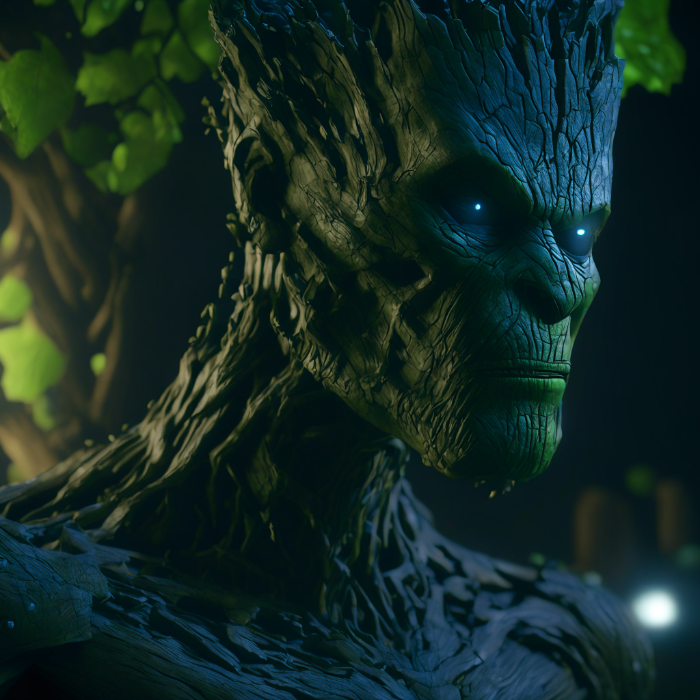

# Preliminaries

1. Make sure your python environment has kozmodb and replicate installed.

# KozmoDB example commands

1. Create an Image Generating AI Model using REPLICATE engine:
   
```sql
CREATE MODEL aiforever
PREDICT url
USING
    engine = 'replicate',
    model_name= 'ai-forever/kandinsky-2',
    version ='2af375da21c5b824a84e1c459f45b69a117ec8649c2aa974112d7cf1840fc0ce',
    api_key = 'r8_BpO.........................';
```

2. Now you can use DESCRIBE PREDICTOR query to check available parameters for our model:

```sql
DESCRIBE PREDICTOR kozmodb.aiforever.features;
```

3. Now you can use available parameters to make your predictions and customize it.
   
```sql 
SELECT *
FROM aiforever
WHERE prompt='Groot strong determined attitude, intricate design and details, ultra-detailed, highest detail quality, ultra-realistic, photography lighting, reflection mapping, photorealistic, cinematic, cinematic noise, movie quality rendering, octane rendering, sharp focus, 8k, depth of field, real shadow, rtx ray tracing lighting,'
USING
scheduler='plms_sampler',
width=1024,
height=1024;
```

### OUTPUT 
# TODO


